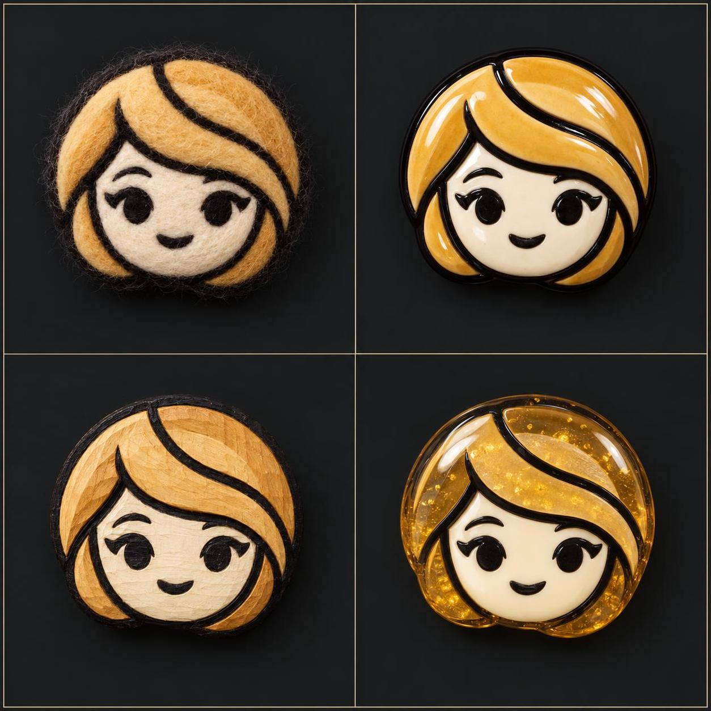

# GPT Image 2.5 Prompts & Examples — by Alosem

Original examples and exact prompts — curated by Alosem.

See what each prompt produced and adapt it for your own work. The standalone and transparent cases need no source images; the character-identity cases were generated from reference sheets, which are published alongside each case so you can compare the result with its inputs. Browse all 37 reviewed examples here or continue in Alosem.

[Browse examples](#category-index) · [Open the visual gallery](https://alosem.com/s/gpt-image-2-5) · [Read the JSON catalogue](data/cases.json)

Independent community resource. Not affiliated with or endorsed by OpenAI.

## Six examples to start with

<table>
<tr>
<td align="center" valign="top"><a href="cases/cream-terminal-that-never-existed-b3d4a9d3.md"></a><br><strong>Cream Terminal That Never Existed</strong></td>
<td align="center" valign="top"><a href="cases/glow-retro-poster-of-a-bass-player-and-boy-6b2eb59a.md"></a><br><strong>Glow Retro Poster of a Bass Player and Boy</strong></td>
<td align="center" valign="top"><a href="cases/pressed-flower-wren-on-twig-slice-4712aff7.md"></a><br><strong>Pressed Flower Wren on Twig Slice</strong></td>
</tr>
<tr>
<td align="center" valign="top"><a href="cases/canal-bridge-screenprint-slice-1919a777.md"></a><br><strong>Canal Bridge Screenprint Slice</strong></td>
<td align="center" valign="top"><a href="cases/girl-holding-a-fallen-moon-in-a-tidal-pool-65b8e726.md"></a><br><strong>Girl Holding a Fallen Moon in a Tidal Pool</strong></td>
<td align="center" valign="top"><a href="cases/ancient-sword-bridges-a-canyon-of-pages-0a39debe.md"></a><br><strong>Ancient Sword Bridges a Canyon of Pages</strong></td>
</tr>
</table>

This release contains standalone generations, transparent assets, and reference-based character-identity cases. The character-identity cases were generated by the Alosem team from founder-provided identity sheets; reproducing them requires those reference sheets as image inputs, and each sheet is published under `assets/references/` and embedded in its case pages for comparison. No case is labeled an edit because no reviewed public edit exposed its required source images.

## Category index

<!-- category-counts {"product_visuals":4,"posters_typography":1,"transparent_assets":6,"character_identity":7,"illustration_backgrounds":19,"focused_edits":0} -->

| Category | Cases |
| --- | ---: |
| [Product visuals](#cat-product_visuals) | 4 |
| [Posters & typography](#cat-posters_typography) | 1 |
| [Transparent assets](#cat-transparent_assets) | 6 |
| [Character identity](#cat-character_identity) | 7 |
| [Illustration & backgrounds](#cat-illustration_backgrounds) | 19 |
| Focused edits | 0 |

Every case, inline, in catalogue order:

<a id="cat-product_visuals"></a>

### Product visuals (4)

<table>
<tr>
<td align="center" valign="top"><a href="cases/06-minimalist-scooter-village-2f97d52a.md"></a><br><strong>06 Minimalist Scooter Village</strong></td>
<td align="center" valign="top"><a href="cases/mint-concept-motorcycle-in-a-dark-garage-8b5688cf.md"></a><br><strong>Mint Concept Motorcycle in a Dark Garage</strong></td>
<td align="center" valign="top"><a href="cases/chrome-watering-can-pours-a-silver-arc-579c8330.md"></a><br><strong>Chrome Watering Can Pours a Silver Arc</strong></td>
</tr>
<tr>
<td align="center" valign="top"><a href="cases/cream-terminal-that-never-existed-b3d4a9d3.md"></a><br><strong>Cream Terminal That Never Existed</strong></td>
</tr>
</table>

<a id="cat-posters_typography"></a>

### Posters & typography (1)

<table>
<tr>
<td align="center" valign="top"><a href="cases/glow-retro-poster-of-a-bass-player-and-boy-6b2eb59a.md"></a><br><strong>Glow Retro Poster of a Bass Player and Boy</strong></td>
</tr>
</table>

<a id="cat-transparent_assets"></a>

### Transparent assets (6)

<table>
<tr>
<td align="center" valign="top"><a href="cases/pressed-flower-wren-on-twig-slice-4712aff7.md"></a><br><strong>Pressed Flower Wren on Twig Slice</strong></td>
<td align="center" valign="top"><a href="cases/iron-dragonfly-on-reeds-slice-2900cbdd.md"></a><br><strong>Iron Dragonfly on Reeds Slice</strong></td>
<td align="center" valign="top"><a href="cases/punched-tin-sun-medallion-slice-946dfa40.md"></a><br><strong>Punched Tin Sun Medallion Slice</strong></td>
</tr>
<tr>
<td align="center" valign="top"><a href="cases/spring-ridge-walk-leaf-collage-slice-1d5e0d44.md"></a><br><strong>Spring Ridge Walk Leaf Collage Slice</strong></td>
<td align="center" valign="top"><a href="cases/quilled-blossom-branch-with-birds-7cd0690d.md"></a><br><strong>Quilled Blossom Branch with Birds</strong></td>
<td align="center" valign="top"><a href="cases/canal-bridge-screenprint-slice-1919a777.md"></a><br><strong>Canal Bridge Screenprint Slice</strong></td>
</tr>
</table>

<a id="cat-character_identity"></a>

### Character identity (7)

<table>
<tr>
<td align="center" valign="top"><a href="cases/blond-man-studies-a-rainy-city-model-9acedb62.md"></a><br><strong>Blond Man Studies a Rainy City Model</strong></td>
<td align="center" valign="top"><a href="cases/blond-man-crosses-the-morning-flower-market-d2d3b695.md"></a><br><strong>Blond Man Crosses the Morning Flower Market</strong></td>
<td align="center" valign="top"><a href="cases/blond-woman-finds-a-rare-jazz-record-8d3314a5.md"></a><br><strong>Blond Woman Finds a Rare Jazz Record</strong></td>
</tr>
<tr>
<td align="center" valign="top"><a href="cases/red-haired-woman-tends-the-glasshouse-seedlings-37eb8b40.md"></a><br><strong>Red-Haired Woman Tends the Glasshouse Seedlings</strong></td>
<td align="center" valign="top"><a href="cases/merle-bulldog-explores-a-misty-tidepool-e42f702d.md"></a><br><strong>Merle Bulldog Explores a Misty Tidepool</strong></td>
<td align="center" valign="top"><a href="cases/sema-becomes-a-glazed-ceramic-portrait-337c92bd.md"></a><br><strong>Sema Becomes a Glazed Ceramic Portrait</strong></td>
</tr>
<tr>
<td align="center" valign="top"><a href="cases/sema-travels-across-four-crafted-materials-36e3d7f0.md"></a><br><strong>Sema Travels Across Four Crafted Materials</strong></td>
</tr>
</table>

<a id="cat-illustration_backgrounds"></a>

### Illustration & backgrounds (19)

<table>
<tr>
<td align="center" valign="top"><a href="cases/cub-sending-off-a-paper-boat-d16dc431.md"></a><br><strong>Cub Sending Off a Paper Boat</strong></td>
<td align="center" valign="top"><a href="cases/paper-boats-carrying-small-planets-fae5026b.md"></a><br><strong>Paper Boats Carrying Small Planets</strong></td>
<td align="center" valign="top"><a href="cases/small-storm-spirit-brewing-tea-99225b4c.md"></a><br><strong>Small Storm Spirit Brewing Tea</strong></td>
</tr>
<tr>
<td align="center" valign="top"><a href="cases/glass-whale-carrying-light-fish-a539a581.md"></a><br><strong>Glass Whale Carrying Light Fish</strong></td>
<td align="center" valign="top"><a href="cases/forest-giant-waits-for-the-last-bus-658fea7d.md"></a><br><strong>Forest Giant Waits for the Last Bus</strong></td>
<td align="center" valign="top"><a href="cases/radio-telescope-inside-a-paper-spiral-5279e774.md"></a><br><strong>Radio Telescope Inside a Paper Spiral</strong></td>
</tr>
<tr>
<td align="center" valign="top"><a href="cases/paper-city-living-canopy-55f0fc0d.md"></a><br><strong>Paper City, Living Canopy</strong></td>
<td align="center" valign="top"><a href="cases/mapmaker-unfolding-a-city-e9f8e7a1.md"></a><br><strong>Mapmaker Unfolding a City</strong></td>
<td align="center" valign="top"><a href="cases/silk-thread-river-5e0f485f.md"></a><br><strong>Silk Thread River</strong></td>
</tr>
<tr>
<td align="center" valign="top"><a href="cases/paper-light-box-village-at-dusk-db4a7a9e.md"></a><br><strong>Paper Light-Box Village at Dusk</strong></td>
<td align="center" valign="top"><a href="cases/red-crosshatch-portrait-of-an-old-astronomer-fca9cc5e.md"></a><br><strong>Red Crosshatch Portrait of an Old Astronomer</strong></td>
<td align="center" valign="top"><a href="cases/torn-paper-swimmer-mid-dive-a960b5d6.md"></a><br><strong>Torn Paper Swimmer Mid Dive</strong></td>
</tr>
<tr>
<td align="center" valign="top"><a href="cases/felted-fox-asleep-on-a-wool-cloud-8c8d1e4b.md"></a><br><strong>Felted Fox Asleep on a Wool Cloud</strong></td>
<td align="center" valign="top"><a href="cases/analyst-facing-a-mountain-of-postponed-letters-c9d145b5.md"></a><br><strong>Analyst Facing a Mountain of Postponed Letters</strong></td>
<td align="center" valign="top"><a href="cases/rust-seam-splitting-a-gray-painted-face-7cabb9a6.md"></a><br><strong>Rust Seam Splitting a Gray Painted Face</strong></td>
</tr>
<tr>
<td align="center" valign="top"><a href="cases/copper-heron-machine-hunting-in-flooded-terraces-7fff6a56.md"></a><br><strong>Copper Heron Machine Hunting in Flooded Terraces</strong></td>
<td align="center" valign="top"><a href="cases/goldfish-swims-beneath-a-broken-moon-reflection-e7df7e9a.md"></a><br><strong>Goldfish Swims Beneath a Broken Moon Reflection</strong></td>
<td align="center" valign="top"><a href="cases/ancient-sword-bridges-a-canyon-of-pages-0a39debe.md"></a><br><strong>Ancient Sword Bridges a Canyon of Pages</strong></td>
</tr>
<tr>
<td align="center" valign="top"><a href="cases/girl-holding-a-fallen-moon-in-a-tidal-pool-65b8e726.md"></a><br><strong>Girl Holding a Fallen Moon in a Tidal Pool</strong></td>
</tr>
</table>

<a id="cat-focused_edits"></a>

### Focused edits (0)

No reviewed case in this release.

## Complete worked example

### [Glow Retro Poster of a Bass Player and Boy](cases/glow-retro-poster-of-a-bass-player-and-boy-6b2eb59a.md)

A retro flat-shape poster of a tall bass player and a boy with a green paper lantern walking under giant red GLOW letters.

<p align="center"><a href="https://alosem.com/i/glow-retro-poster-of-a-bass-player-and-boy-6b2eb59a"></a></p>

#### Exact prompt

```text
Composed on a tall 9:16 vertical portrait canvas like a retro film poster. A flat-shaped graphic poster: a very tall man in a long black coat carries a double-bass case at his side while a small boy beside him holds up a green paper lantern on a short pole; both walk left to right across the lower third of the canvas, the man's head reaching up into the lettering zone.

Behind and above them the word GLOW spans the full width in enormous flat red display letters, cropped by the canvas edges exactly like vintage poster typography. A large plain red disc sits low on the right behind the pair, and simple dark city silhouettes with one green plant-leaf shape frame the bottom corners.

Style: flat vector-like shapes with subtle print grain, a limited palette of cream paper, black, vivid red and one green accent, soft long shadows on the ground plane. Playful scale contrast between the tall figure and the small child, the lantern suggested by a soft green halo. Minimal retro-poster mood.
```

**Review:** Letter-by-letter against the prompt's 'the word GLOW spans the full width in enormous flat red display letters, cropped by the canvas edges': G-L-O-W, left to right, four glyphs, no substitution, duplication, omission or extra word. Edge cropping of the G and the display type is explicitly requested, not a defect. Tall man in long black coat with double-bass case, small boy with green paper lantern on a short pole, both walking left to right, man's head into the lettering zone, red disc low right, dark city silhouettes and one green leaf shape at the bottom corners - all delivered. No gibberish text anywhere else.

[Open in Alosem](https://alosem.com/i/glow-retro-poster-of-a-bass-player-and-boy-6b2eb59a) · [Read the complete case](cases/glow-retro-poster-of-a-bass-player-and-boy-6b2eb59a.md)

## Provenance

Generated with built-in imagegen. Listed under the GPT Image 2.5 family; the exact backend variant was not exposed.

No seed, API quality setting, cost, or backend ID is claimed because those values were not exposed. “Made with Alosem” is used only when Alosem was part of the creative workflow, and externally published examples are **Curated on Alosem**. The character-identity cases are team-generated campaign work and carry a third label, **Created for Alosem**.

## Use the catalogue

The machine-readable [catalogue](data/cases.json) and [schema](schema/cases.schema.json) drive every case page and the counts above. Refresh and verify the export with:

```sh
node scripts/export.mjs
node --test scripts/*.test.mjs
node scripts/validate.mjs --links
```

## Contributing and licensing

Contributions must provide a public Alosem image, the exact submitted prompt, accurate model-family provenance, rights to share the material, and a completed visual review. See [CONTRIBUTING.md](CONTRIBUTING.md).

Catalogue text and structured data are [CC BY 4.0](LICENSE); scripts are [MIT](LICENSE-CODE). Linked images remain remotely hosted and are not relicensed here. See [RIGHTS.md](RIGHTS.md).
