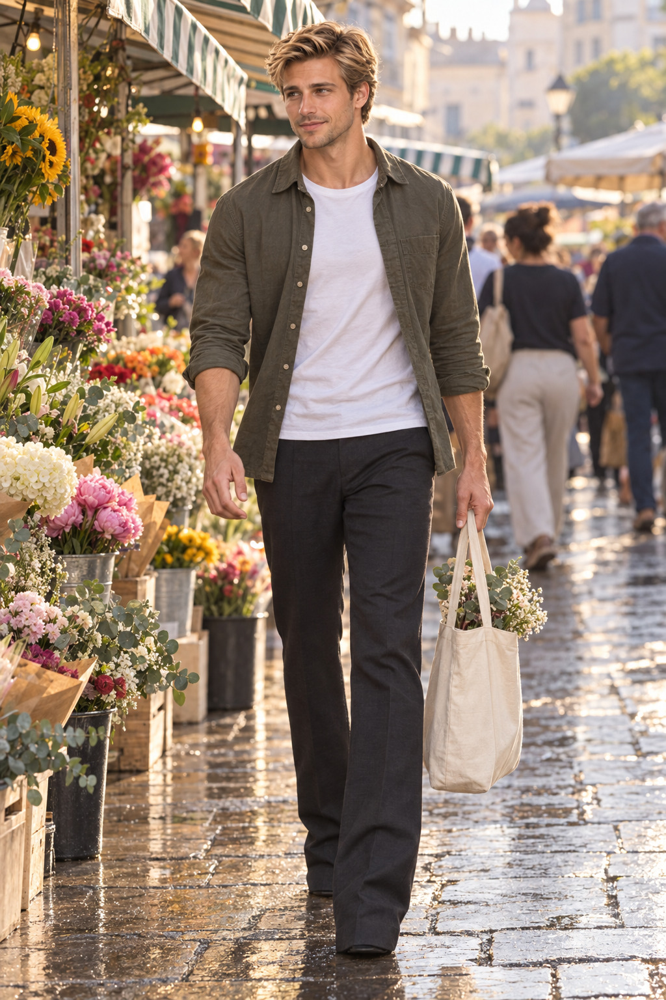

# Blond Man Crosses the Morning Flower Market

The blond character moves through a sunlit flower market with an easy smile and a plain canvas tote.

<p align="center"></p>

## Exact prompt

Copy this standalone prompt as a starting point. Image generation is nondeterministic, so a rerun will not reproduce identical pixels.

```text
A candid photorealistic street photograph of the same distinctive blond, brown-eyed young man walking through an early-morning flower market. His moderately long oval face, broad cheekbones, firm tapered jaw, light stubble, high swept-wavy hair mass, broad shoulders, narrow waist, and long athletic limbs remain recognizable. He carries a plain canvas tote in one hand and smiles toward a flower stall while taking a natural stride. Soft sun, striped awnings, buckets of flowers, and shallow depth of field create an easy, optimistic mood. Full body and both hands are visible; no readable signs, logos, or watermark.
```

## Reference-based run recipe

This case was generated from founder-provided reference sheets rather than from text alone. The sheets are required image inputs to reproduce the run; each is published below and under `assets/references/` so the result can be compared with its references, and the standalone prompt above remains the public copyable prompt.

**Ordered references**

1. `assets/references/blond-male-identity-sheet.png` — Sole blond-male identity anchor; face geometry, brown eyes, light stubble, swept-wavy hair mass, athletic body proportions, expressions, and hand anatomy
   - SHA-256 `bfaa509e0492c7496dceaa14486a552029262e01e39407411cfbb07003c74523`
   - Founder-supplied identity sheet; founder-stated GPT Image 2.5 output.

<p align="center"><a href="../assets/references/blond-male-identity-sheet.png"></a></p>

**Exact execution prompt**

```text
Use case: identity-preserve
Asset type: character-consistency campaign scene
Primary request: Generate a fresh candid photorealistic full-body street scene of the exact blond male identity from Image 1 walking through an early-morning flower market, carrying a plain canvas tote and smiling toward a flower stall. Preserve the same flower-market scene and identity intent while structurally removing visible footwear detail.
Input images: Image 1 is the sole identity anchor. Preserve its face, hair, eyes, skin, stubble, body proportions, and age; do not copy the reference-sheet layout or black athletic outfit.
Scene/backdrop: Open-air flower market with striped awnings, simple unlabeled buckets of flowers, pale wet stone street, softly blurred shoppers far behind, and subtle ground reflections.
Subject and load-bearing identity proportions: One principal man. Preserve the moderately long oval face, clearly longer than wide; broad cheekbones; firm tapered jaw; medium-square chin; brown eyes; light stubble. Preserve the high, wide mass of swept wavy dark-blond hair. Preserve the athletic mesomorphic body: broad shoulders, developed but not bulky chest and arms, narrow waist, long balanced legs. Do not shorten the legs or enlarge the head.
Wardrobe: Muted olive overshirt open over a plain white T-shirt and full-length dark tailored trousers. Both trouser legs use the same straight tailored cut and extend fully to the ground, with matching long cuffs that break cleanly and deeply over the feet. The cuffs fully cover all footwear on both feet. No shoe upper, collar, tongue, lacing, eyelets, ankle opening, or footwear construction is visible anywhere. At most, an identical simple flat dark toe/sole contact sliver may appear directly below each matching trouser cuff, without any upper detail. Unbranded cream canvas tote.
Pose/activity: Natural measured walking step, relaxed smile, head turned slightly toward the flowers; right hand holds the tote handles, left arm swings naturally. Keep the step compact enough that both long trouser cuffs continue to cover the footwear completely.
Composition/framing: Vertical full-body environmental portrait with both trouser hems, both ground-contact points, both arms, and both hands completely visible and contained. The full-length matching cuffs must obscure both shoes symmetrically. Wet-ground reflections may suggest two simple matching dark footwear shapes, but must not reveal or invent shoe details.
Lighting/mood: Soft low morning sunlight, warm and spontaneous, realistic street color with restrained wet-stone reflections.
Constraints: Identity fidelity and load-bearing proportions take priority. Exactly one principal head, two arms, two hands, two long trouser legs, two fully covered feet, and two matching trouser cuffs; five fingers per visible hand with natural joints; normal gait and weight distribution. Footwear must be fully concealed behind the cuffs on both feet. No visible shoe upper, collar, shaft, tongue, lace, eyelet, panel seam, logo, or mismatched footwear detail. Background shoppers remain indistinct and do not resemble the subject. No readable text, gibberish, logos, watermark, duplicated subject, fused limbs, extra fingers, cropped hems, cropped ground-contact points, or reference-sheet panels.
Avoid: visible sneakers, visible shoe construction, exposed ankles, raised trouser cuffs, different hem lengths, asymmetric cuff breaks, round widened face, narrow pointed chin, flat hair, bodybuilder bulk, short stocky legs, beard, blue eyes, fashion-editorial airbrushing, illustration, 3D render.
```

## Provenance

| Field | Value |
| --- | --- |
| Model family | GPT Image 2.5 |
| Generation tool | built-in imagegen |
| Exact backend | unknown |
| Mode | reference-based identity-preserve |
| Dimensions | 1024 × 1536 |
| Transparency | No |

Generated with built-in imagegen. Listed under the GPT Image 2.5 family; the exact backend variant was not exposed.

## Review notes and limitations

**pass · checked 2026-09-17.** Resolved after two repair passes. The first two generations were flagged for mismatched footwear; the selected third generation instead puts the subject in matching floor-length tailored trousers whose cuffs cover both feet, so the footwear defect class is structurally eliminated rather than re-attempted, with only identical flat dark toe/sole slivers below each hem. Footwear was never an identity attribute here — the reference turnaround shows this subject barefoot in all five views. Identity holds against the same anchor as the rain-studio case (iris R−B of +70 and +82, brown; same long oval face, broad cheekbones, firm tapered jaw, light stubble, and high swept-wavy hair mass). Note: this is a fresh full render, not the earlier frame, so the market sits to the left, the pavement is wet and reflective, and the background crowd differs. Both hands are clean, background shoppers are indistinct, and no readable text, logo, or watermark appears. Minor note: the trouser hems read a little wider and more flared than the prompt's 'straight tailored cut'.

This team-generated campaign case was produced directly by the Alosem team with built-in imagegen from founder-provided identity sheets; it is neither externally published nor created through the Alosem creative product, so it is labeled **Created for Alosem**.

Catalogue text and data are licensed under [CC BY 4.0](../LICENSE). The preview image is hosted in this repository under the same licence.
