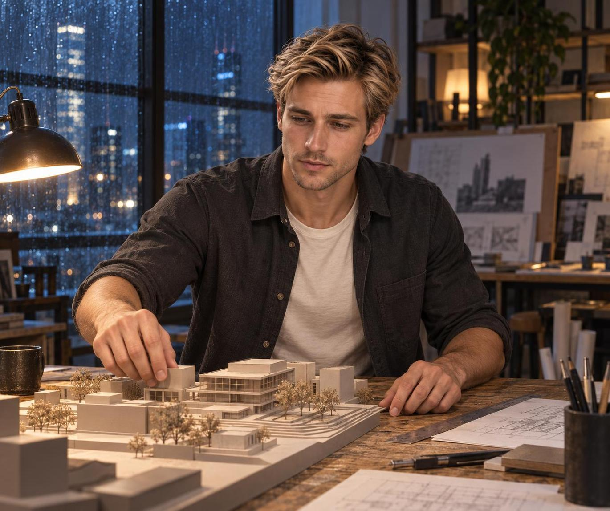
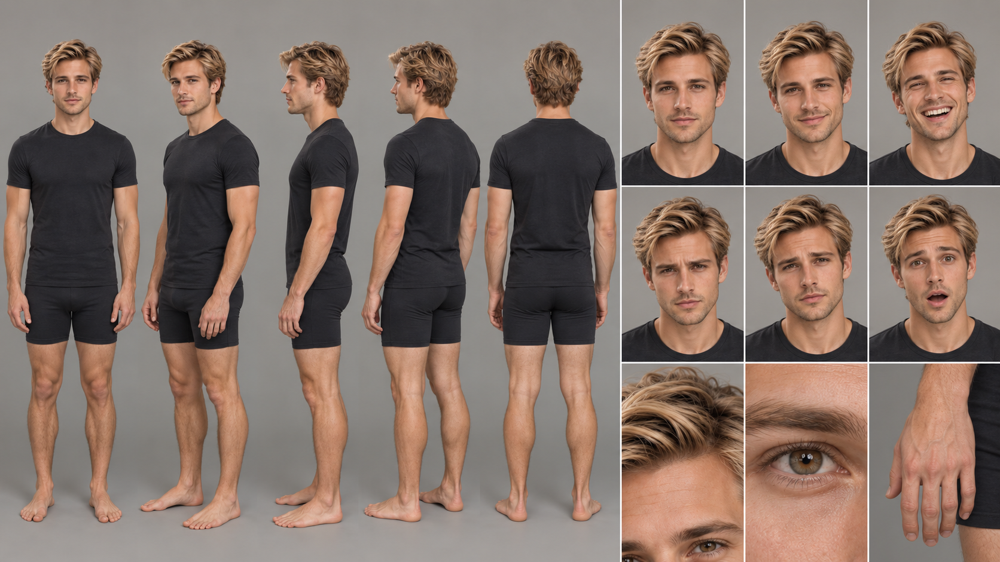

# Blond Man Studies a Rainy City Model

A focused blond architect adjusts a scale model beneath warm task lights as rain blurs the city windows.

<p align="center"></p>

## Exact prompt

Copy this standalone prompt as a starting point. Image generation is nondeterministic, so a rerun will not reproduce identical pixels.

```text
A photorealistic editorial photograph of a blond, brown-eyed young man with light stubble and a swept wavy hairstyle working late in an architectural studio. His moderately long oval face, broad cheekbones, firm tapered jaw, athletic broad-shouldered build, and high-volume hair remain distinctive. In a three-quarter waist-up view, he leans over a scale model and adjusts one small building piece with a focused hand while rain traces the tall windows behind him. Warm task lamps balance the cool blue city light. Natural skin, believable fingers, worn drafting materials, no readable text, logos, or watermark.
```

## Reference-based run recipe

This case was generated from founder-provided reference sheets rather than from text alone. The sheets are required image inputs to reproduce the run; each is published below and under `assets/references/` so the result can be compared with its references, and the standalone prompt above remains the public copyable prompt.

**Ordered references**

1. `assets/references/blond-male-identity-sheet.png` — Sole blond-male identity anchor; face geometry, brown eyes, light stubble, swept-wavy hair mass, athletic body proportions, expressions, and hand anatomy
   - SHA-256 `bfaa509e0492c7496dceaa14486a552029262e01e39407411cfbb07003c74523`
   - Founder-supplied identity sheet; founder-stated GPT Image 2.5 output.

<p align="center"><a href="../assets/references/blond-male-identity-sheet.png"></a></p>

**Exact execution prompt**

```text
Use case: identity-preserve
Asset type: character-consistency campaign scene
Primary request: Generate a new photorealistic editorial scene of the exact blond male identity from Image 1 working late in a rainy architectural studio, leaning over a scale model and adjusting one small building piece with his right hand.
Input images: Image 1 is the sole identity anchor. Preserve its face, hair, eyes, skin, stubble, body proportions, and age; do not copy the reference-sheet layout or black athletic outfit.
Scene/backdrop: Contemporary architecture studio at night, tall rain-streaked windows, blurred blue city lights, warm task lamps, scale model and drafting materials with no readable writing.
Subject and load-bearing identity proportions: One man only. Preserve the moderately long oval face, clearly longer than wide; broad cheekbones; firm jaw that tapers without becoming narrow; medium-square chin; straight balanced nose; brown eyes; light stubble. Preserve the high, wide mass of swept wavy dark-blond hair rather than flattening or shortening it. Preserve the athletic mesomorphic body: broad shoulders, developed but not bulky arms and chest, narrow waist, long balanced limbs. Age remains mid-to-late twenties.
Wardrobe: Charcoal rolled-sleeve overshirt over a plain cream T-shirt; no branding.
Composition/framing: Three-quarter waist-up editorial photograph, face unobscured, both forearms visible, right hand adjusting one model piece, left hand resting naturally on the table; entire hands remain in frame.
Lighting/mood: Cool rainy-window ambience with warm amber task light; focused, quietly absorbed expression.
Materials/textures: Real skin pores and stubble, individual hair strands, matte card model, worn wood table, rain on glass.
Constraints: Identity fidelity and load-bearing proportions take priority over scene styling. Exactly one head, two eyes, two arms, two hands, five fingers per visible hand with natural joints; no fused or duplicated digits. No readable text, gibberish, logos, watermark, extra people, extra limbs, cropped hands, glamorized skin, or reference-sheet panels.
Avoid: widened round face, narrow pinched jaw, flat or helmet-like hair, bodybuilder bulk, teenager appearance, beard, blue eyes, illustration, 3D render.
```

## Provenance

| Field | Value |
| --- | --- |
| Model family | GPT Image 2.5 |
| Generation tool | built-in imagegen |
| Exact backend | unknown |
| Mode | reference-based identity-preserve |
| Dimensions | 1370 × 1148 |
| Transparency | No |

Generated with built-in imagegen. Listed under the GPT Image 2.5 family; the exact backend variant was not exposed.

## Review notes and limitations

**pass · checked 2026-09-17.** Independent verification confirmed identity fidelity against the blond-male turnaround: a long oval face clearly longer than wide, broad cheekbones, a firm tapered jaw and medium-square chin, light stubble, and the high swept-wavy hair mass preserved rather than flattened, on an athletic broad-shouldered build. Because the downcast irises read grey-blue at display scale, they were sampled numerically: iris R−B of +61 and +78 against the reference panel's +59 confirms the prompted brown eyes. The reaching hand shows four fingers plus a nailed thumb, the resting hand four nailed fingers with the thumb occluded, and both hands remain fully in frame as asked. Background boards and drawings carry no lettering, and no watermark, extra person, or reference-sheet panel appears.

This team-generated campaign case was produced directly by the Alosem team with built-in imagegen from founder-provided identity sheets; it is neither externally published nor created through the Alosem creative product, so it is labeled **Created for Alosem**.

Catalogue text and data are licensed under [CC BY 4.0](../LICENSE). The preview image is hosted in this repository under the same licence.
