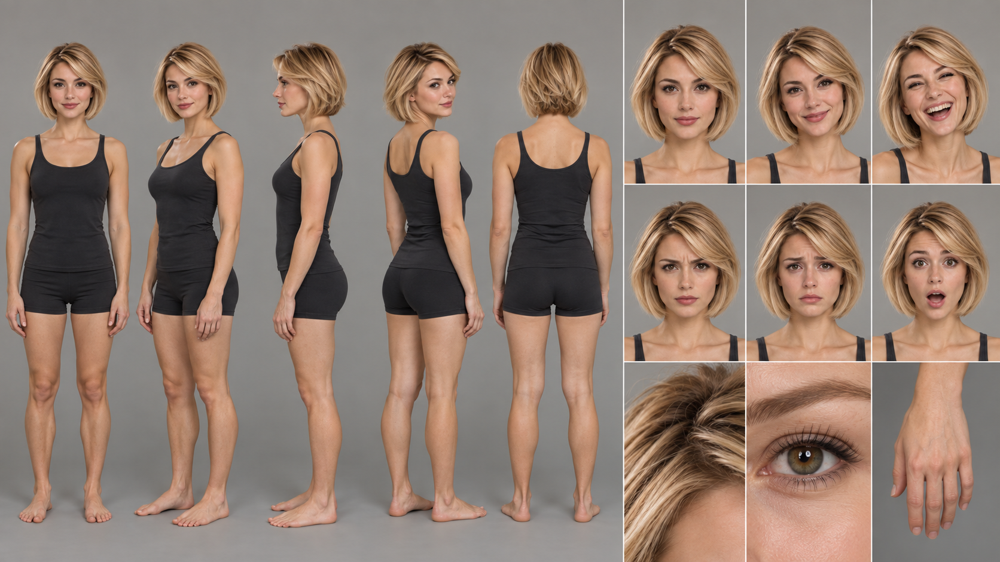

# Blond Woman Finds a Rare Jazz Record

A blonde woman pauses over an unbranded record sleeve in the warm hush of a vintage music shop.

<p align="center"></p>

## Exact prompt

Copy this standalone prompt as a starting point. Image generation is nondeterministic, so a rerun will not reproduce identical pixels.

```text
A photorealistic lifestyle photograph of a blonde, brown-eyed young woman browsing a quiet vintage record store. Her softly heart-oval face, broad cheekbones, small tapered chin, rounded chin-length bob, and compact athletic hourglass build remain distinctive. In a three-quarter mid-length view, she slides a single unbranded record sleeve from a wooden bin with both hands and gives a small pleased smile. Warm window light, amber wood, and dusty jewel-toned sleeves create an intimate discovery. Fingers and sleeve edges are clean; no readable album text, logos, or watermark.
```

## Reference-based run recipe

This case was generated from founder-provided reference sheets rather than from text alone. The sheets are required image inputs to reproduce the run; each is published below and under `assets/references/` so the result can be compared with its references, and the standalone prompt above remains the public copyable prompt.

**Ordered references**

1. `assets/references/blond-female-identity-sheet.png` — Sole blond-female identity anchor; heart-oval face geometry, brown eyes, rounded chin-length bob mass, compact athletic-hourglass body proportions, expressions, and hand anatomy
   - SHA-256 `ac592b95c4ee8e75b0c64e522039823e51f9823bac3de5cc8c93c8d54c3c7b85`
   - Founder-supplied identity sheet; founder-stated GPT Image 2.5 output.

<p align="center"><a href="../assets/references/blond-female-identity-sheet.png"></a></p>

**Exact execution prompt**

```text
Use case: identity-preserve
Asset type: character-consistency campaign scene
Primary request: Generate a new photorealistic lifestyle scene of the exact blond female identity from Image 1 browsing a quiet vintage record store and lifting one unbranded record sleeve from a wooden bin.
Input images: Image 1 is the sole identity anchor. Preserve its face, chin-length bob, eyes, skin, body proportions, and age; do not copy the reference-sheet layout or black athletic outfit.
Scene/backdrop: Small vintage record shop with wooden bins, softly blurred shelves, warm front-window light, and abstract unlettered sleeve art.
Subject and load-bearing identity proportions: One woman only. Preserve the softly heart-oval face, only modestly longer than wide; broad cheekbones; compact lower face; small tapered chin; brown almond-shaped eyes; straight small nose; full but natural lips. Preserve the rounded chin-length blonde bob: side part, smooth swept fringe, outer hair mass wider than the jaw, ends curving inward at jaw level. Preserve the compact athletic hourglass build with moderate shoulders, defined waist, balanced hips, and neither elongated nor extremely thin limbs.
Wardrobe: Simple rust-colored knit top with elbow-length sleeves and high-waisted dark denim; no branding or jewelry that obscures identity.
Pose/activity: Three-quarter mid-length view, both hands naturally holding the opposite edges of one record sleeve, small pleased smile, eyes glancing at the sleeve.
Lighting/mood: Warm diffused window light, intimate and quietly delighted.
Constraints: Identity fidelity and load-bearing proportions take priority. Exactly one head, two arms, two hands, five fingers per visible hand; clean sleeve geometry and natural grip. No readable text, gibberish, logos, watermark, extra people in focus, extra limbs, fused fingers, cropped hands, photorealistic identity drift, or reference-sheet panels.
Avoid: long narrow face, enlarged chin, long hair, pixie cut, flattened bob, oversized hair helmet, tall runway-thin body, exaggerated curves, blue eyes, heavy makeup, illustration, 3D render.
```

## Provenance

| Field | Value |
| --- | --- |
| Model family | GPT Image 2.5 |
| Generation tool | built-in imagegen |
| Exact backend | unknown |
| Mode | reference-based identity-preserve |
| Dimensions | 1024 × 1536 |
| Transparency | No |

Generated with built-in imagegen. Listed under the GPT Image 2.5 family; the exact backend variant was not exposed.

## Review notes and limitations

**pass · checked 2026-09-17.** Verification confirmed the load-bearing bob geometry against the blond-female turnaround: softly heart-oval face only modestly longer than wide, broad cheekbones, small tapered chin, brown almond eyes, and a rounded chin-length bob with a side part, swept fringe, outer hair mass wider than the jaw, and ends curving inward at jaw level. Both hands hold opposite edges of a single sleeve with coherent grip and no fused or extra digits. Wall shelves and record bins were swept at native resolution for ambient text: every sleeve is abstract colour-field art with no lettering or gibberish. Notes, not defects: the framing runs closer to three-quarter full-length than the prompt's 'mid-length' view, the face carries more eye makeup than the reference's natural look, and the hip-to-waist contrast reads slightly fuller than the compact reference build.

This team-generated campaign case was produced directly by the Alosem team with built-in imagegen from founder-provided identity sheets; it is neither externally published nor created through the Alosem creative product, so it is labeled **Created for Alosem**.

Catalogue text and data are licensed under [CC BY 4.0](../LICENSE). The preview image is hosted in this repository under the same licence.
