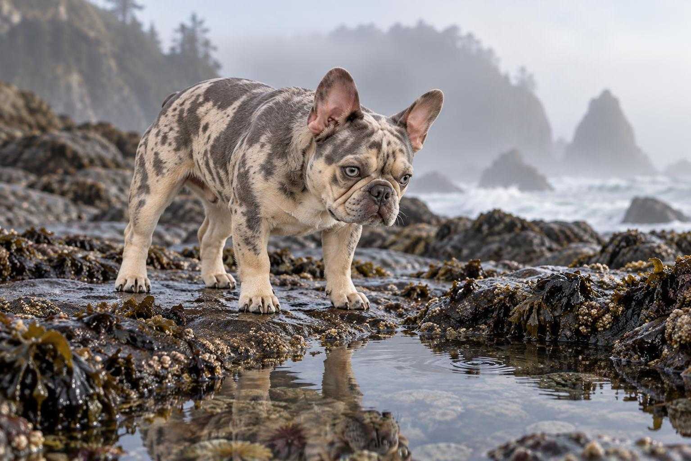

# Merle Bulldog Explores a Misty Tidepool

A blue-gray merle French bulldog studies a reflective tidepool on a cool, mist-softened coast.

<p align="center"></p>

## Exact prompt

Copy this standalone prompt as a starting point. Image generation is nondeterministic, so a rerun will not reproduce identical pixels.

```text
A crisp natural photograph of a blue-gray merle French bulldog exploring a misty coastal tidepool. The dog keeps its broad nearly square head, tall wide-set bat ears, extremely short muzzle, pale blue-gray eyes, cream chest, compact cobby muscular torso, wide stance, and short sturdy legs. It stands alert on wet dark rocks with all four paws visible, looking down at a small reflective pool while sea mist softens the background. Merle patches remain coherent across head and body; whiskers, nose, paws, and reflection are clean. No collar, costume, text, logos, or watermark.
```

## Reference-based run recipe

This case was generated from founder-provided reference sheets rather than from text alone. Those sheets are required image inputs to reproduce the run, they are not included in this repository, and the standalone prompt above remains the public copyable prompt.

**Ordered references**

1. `ChatGPT Image Sep 13, 2026, 10_34_09 PM.png` — Sole merle French bulldog identity anchor; square head, wide-set bat ears, short muzzle, pale eyes, merle pattern language, cobby body proportions, and paw anatomy
   - SHA-256 `dbccf357892830cd1c717d6cc69a863c58547d0c7017ec7fe6afc0256b9332c9`
   - Founder-supplied identity sheet; founder-stated GPT Image 2.5 output.

**Exact execution prompt**

```text
Use case: identity-preserve
Asset type: character-consistency campaign scene
Primary request: Generate a new natural photorealistic scene of the exact merle French bulldog identity from Image 1 standing alert on wet coastal rocks and investigating a small tidepool in soft morning mist.
Input images: Image 1 is the sole identity anchor. Preserve its head, ears, muzzle, eyes, merle pattern language, body proportions, paws, and age; do not copy the reference-sheet layout or gray studio background.
Scene/backdrop: Quiet rocky coast at low tide, one small reflective tidepool, wet charcoal stones, faint sea foam and misty horizon; no people or other animals.
Subject and load-bearing identity proportions: One dog only. Preserve the broad nearly square head; tall upright bat ears set wide apart with rounded tips; extremely short broad muzzle approximately one quarter of head length; broad dark nose; pale blue-gray eyes set wide; cream blaze on lower face and chest. Preserve the compact cobby muscular torso, wide chest, short sturdy legs, slightly longer body than tall, broad paws, and very short tail. Preserve blue-gray and warm-cream merle patches as irregular mottling rather than stripes or spots.
Pose/activity: Natural four-square standing pose with head lowered slightly toward the pool, ears upright, curious calm expression, all four legs and paws visible and bearing plausible weight.
Composition/framing: Low eye-level landscape photograph, full dog contained with clear separation between all four legs; reflection may appear only inside the tidepool and must not resemble a second dog.
Lighting/mood: Diffused cool morning light, soft mist, quiet curiosity.
Materials/textures: Short realistic fur, wet nose, detailed paw pads/claws where visible, water ripples, slick stone.
Constraints: Identity fidelity and load-bearing proportions take priority. Exactly one dog, one head, two ears, four legs, four paws; anatomically coherent joints and toes. No collar, clothing, readable text, gibberish, logos, watermark, extra animal, duplicated face, extra leg, fused paw, long muzzle, floppy ears, long tail, cropped paws, or reference-sheet panels.
Avoid: tall lean terrier proportions, narrow head, long snout, low ear set, blue coat without cream, dalmatian spots, cartoon style, 3D render.
```

## Provenance

| Field | Value |
| --- | --- |
| Model family | GPT Image 2.5 |
| Generation tool | built-in imagegen |
| Exact backend | unknown |
| Mode | reference-based identity-preserve |
| Dimensions | 1535 × 1024 |
| Transparency | No |

Generated with built-in imagegen. Listed under the GPT Image 2.5 family; the exact backend variant was not exposed.

## Review notes and limitations

**pass · checked 2026-09-17.** Verification confirmed every listed breed marker against the merle French bulldog anchor: broad nearly square head, tall upright bat ears set wide apart with rounded tips, an extremely short wrinkled muzzle, pale blue-grey eyes set wide, cream base coat with irregular blue-grey merle mottling rather than stripes or spots, wide chest, and a short tail stub. The limb count was checked at native resolution: four distinct weight-bearing legs and four coherent paws with separated toes and visible claws, one head, two ears, no fused or duplicated limb, and the tidepool reflection reads as an inverted blur rather than a second dog. Note, not a defect: the measured cream-body length-to-withers ratio of 1.30 sits at the upper end of 'slightly longer than tall', so the build reads a touch leggier and less cobby than the stocky reference, with straighter legs; recognition is unaffected.

This team-generated campaign case was produced directly by the Alosem team with built-in imagegen from founder-provided identity sheets; it is neither externally published nor created through the Alosem creative product, so it is labeled **Created for Alosem**.

Catalogue text and data are licensed under [CC BY 4.0](../LICENSE). The preview image is hosted in this repository under the same licence.
