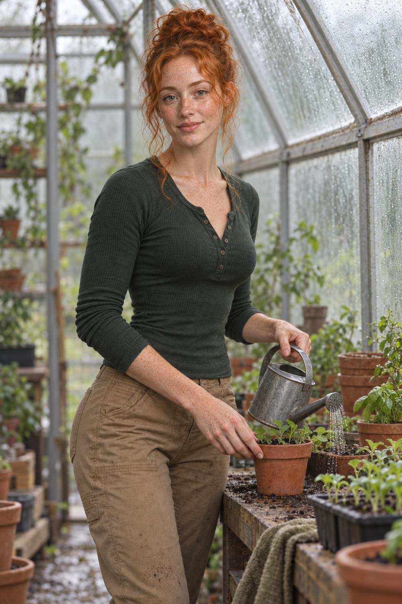

# Red-Haired Woman Tends the Glasshouse Seedlings

A freckled red-haired woman waters young plants beneath the misted panes of a quiet glasshouse.

<p align="center"></p>

## Exact prompt

Copy this standalone prompt as a starting point. Image generation is nondeterministic, so a rerun will not reproduce identical pixels.

```text
A natural photorealistic portrait of a freckled red-haired, green-hazel-eyed young woman tending seedlings in a misty glasshouse. Her narrow long heart-oval face, high cheekbones, small tapered chin, tall loose bun with wispy tendrils, and slim long-limbed athletic build remain recognizable. In a three-quarter knee-up view, she steadies a small terracotta pot with one hand and gently waters it with the other, smiling softly at the new growth. Diffused overcast light, wet glass, fern green, and clay orange create a quiet hopeful mood. Hands are anatomically clean; no text, logos, or watermark.
```

## Reference-based run recipe

This case was generated from founder-provided reference sheets rather than from text alone. Those sheets are required image inputs to reproduce the run, they are not included in this repository, and the standalone prompt above remains the public copyable prompt.

**Ordered references**

1. `8b52a152-8365-563d-abf2-757dcbae8517.jpeg` — Sole red-haired-female identity anchor; long heart-oval face geometry, green-hazel eyes, freckles, tall loose bun mass, slim long-limbed athletic proportions, expressions, and hand anatomy
   - SHA-256 `f24f5626683be71903e209ddbd71653f67bd0ea0dfcdc302126a05bb170d5ae3`
   - Founder-supplied identity sheet; founder-stated GPT Image 2.5 output.

**Exact execution prompt**

```text
Use case: identity-preserve
Asset type: character-consistency campaign scene
Primary request: Generate a new natural photorealistic portrait of the exact red-haired female identity from Image 1 tending seedlings in a misty glasshouse, steadying one terracotta pot and watering it with a small metal can.
Input images: Image 1 is the sole identity anchor. Preserve its face, freckles, eyes, hair, body proportions, and age; do not copy the reference-sheet layout or black athletic outfit.
Scene/backdrop: Humid glasshouse with fogged panes, wooden potting bench, restrained green seedlings, terracotta pots, and no signage.
Subject and load-bearing identity proportions: One woman only. Preserve the narrow long heart-oval face, clearly longer than wide; high cheekbones; slim jaw; small tapered chin; green-hazel eyes; dense natural freckles across nose, cheeks, forehead, arms, and hands. Preserve the tall loose copper-red bun that adds substantial vertical hair mass above the skull, with fine wispy tendrils at both temples and nape. Preserve the slim long-limbed athletic hourglass build with narrow shoulders, defined waist, balanced hips, and long forearms and legs without emaciation.
Wardrobe: Forest-green fitted long-sleeve henley and practical tan trousers; no branding.
Pose/activity: Three-quarter knee-up view, left hand steadying one small pot, right hand holding a small watering can, natural wrists and finger placement, gentle closed-mouth smile.
Lighting/mood: Soft overcast daylight diffused through wet glass; quiet, hopeful, tactile.
Constraints: Identity fidelity and load-bearing proportions take priority. Exactly one head, two arms, two hands; five fingers per visible hand with natural joints; watering-can handle and spout must be coherent. No readable text, gibberish, logos, watermark, extra people, extra limbs, fused fingers, cropped hands, missing freckles, or reference-sheet panels.
Avoid: round short face, wide heavy jaw, low compact bun, straight loose hair, pale unfreckled skin, stocky build, exaggerated thinness, brown eyes, glam makeup, illustration, 3D render.
```

## Provenance

| Field | Value |
| --- | --- |
| Model family | GPT Image 2.5 |
| Generation tool | built-in imagegen |
| Exact backend | unknown |
| Mode | reference-based identity-preserve |
| Dimensions | 1024 × 1536 |
| Transparency | No |

Generated with built-in imagegen. Listed under the GPT Image 2.5 family; the exact backend variant was not exposed.

## Review notes and limitations

**pass · checked 2026-09-17.** Verification confirmed a narrow long heart-oval face clearly longer than wide, high cheekbones, a small tapered chin, a tall loose copper-red bun with substantial vertical mass and fine wispy tendrils at both temples, and a slim long-limbed athletic build. Eyes are distinctly green-hazel, matching the reference's green-iris panel and satisfying the prompt's 'Avoid: brown eyes'. Freckles are dense across forehead, nose, and cheeks and also on the backs of the hands and forearms, genuinely meeting the 'no missing freckles' constraint rather than approximating it. The watering can is fully coherent — body, rim, handle arc bracketed into the body, spout, and a perforated rose emitting real water — and the pot-steadying hand is cleanly articulated. Note, not a defect: the sprinkle lands on the adjacent seedling tray rather than into the pot her other hand steadies.

This team-generated campaign case was produced directly by the Alosem team with built-in imagegen from founder-provided identity sheets; it is neither externally published nor created through the Alosem creative product, so it is labeled **Created for Alosem**.

Catalogue text and data are licensed under [CC BY 4.0](../LICENSE). The preview image is hosted in this repository under the same licence.
