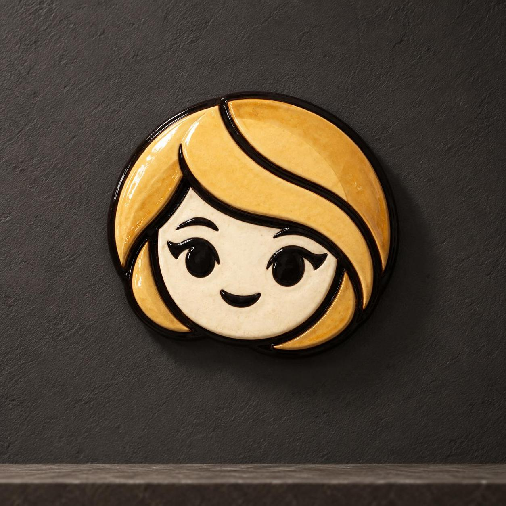

# Sema Becomes a Glazed Ceramic Portrait

Sema's familiar graphic identity becomes a hand-glazed ceramic relief under quiet museum light.

<p align="center"></p>

## Exact prompt

Copy this standalone prompt as a starting point. Image generation is nondeterministic, so a rerun will not reproduce identical pixels.

```text
A studio hero photograph of Sema reimagined as a handcrafted glazed ceramic wall portrait. Her recognizable near-circular blonde-bob silhouette, sweeping golden fringe, low-set ivory face, black oval eyes with winged lashes, and tiny approving smile are modeled in shallow relief. Cream, honey-gold, ochre, and glossy black glazes pool subtly along sculpted contours, with tiny kiln variations and hand-finished edges. The ceramic portrait stands against a warm charcoal plaster wall under soft directional museum light, fully contained with a quiet shadow. No body, nose, text, logos, or watermark.
```

## Reference-based run recipe

This case was generated from founder-provided reference sheets rather than from text alone. Those sheets are required image inputs to reproduce the run, they are not included in this repository, and the standalone prompt above remains the public copyable prompt.

**Ordered references**

1. `sema-directions-v2-review.png` — Primary Sema silhouette, angle, bob geometry, hair-sweep, face-inset, line-placement, and palette anchor
   - SHA-256 `e1d800ae146552a6818e7a4f56ed3b63302a387df3295062dcb4cf79e2c2c786`
   - Founder-supplied raster review sheet; upstream model provenance unavailable.
2. `sema-reactions-v2-review.png` — Primary Sema eye, lash, mouth, expression-language, and accent anchor
   - SHA-256 `7bac316938369e9fae96a10d4e6b864843280f9ce8ceb580b63c7c3b462ed717`
   - Founder-supplied raster review sheet; upstream model provenance unavailable.

**Exact execution prompt**

```text
Use case: style-transfer
Asset type: identity-across-media campaign hero
Primary request: Re-render the exact flat-vector-style Sema head from Images 1 and 2 as a handcrafted glazed ceramic wall portrait photographed as a physical object. Change the medium only; preserve the mascot identity and proportions.
Input images: Image 1 is the primary silhouette, viewing-angle, hair-sweep, face-inset, line-placement, and palette anchor. Image 2 is the primary eye, lash, mouth, and expression-language anchor.
Scene/backdrop: Warm charcoal mineral-plaster wall, subtle museum plinth edge, no other objects.
Subject and load-bearing identity proportions: Exactly one Sema head, no body. Preserve the near-circular horizontal oval silhouette, slightly wider than tall; compact bob ending in two rounded lower side lobes; heavy golden fringe beginning near top-center and sweeping diagonally across the forehead to the lower-right cheek; shorter pointed lock on the left. Preserve the warm-ivory face inset centered low inside the hair mass at roughly two-thirds of total head width, with wide soft cheeks and a small rounded chin. Preserve evenly spaced black oval eyes at mid-face, outer winged lashes, no nose, and a tiny curved approving mouth well below the eyes.
Medium/material: Real handmade glazed ceramic in shallow relief, cream face glaze, honey-gold and ochre hair glazes, glossy near-black outlines/features. Slight glaze pooling and kiln variation, but contours remain crisp and readable.
Composition/framing: Square studio hero, object fully contained with generous wall margin, slight three-quarter physical depth, no crop.
Lighting/mood: Soft directional museum light, gentle physical shadow, refined and tactile.
Constraints: Medium translation must not alter identity geometry. No body, neck, ears, nose, extra face, duplicated object, flattened printed illustration, text, labels, logos, watermark, chipped missing features, or cropped silhouette.
Avoid: taller egg-shaped head, narrow face inset, centered curtain bangs, reversed hair sweep, oversized eyes, realistic human face, emoji redesign, plastic toy, vector-flat rendering.
```

## Provenance

| Field | Value |
| --- | --- |
| Model family | GPT Image 2.5 |
| Generation tool | built-in imagegen |
| Exact backend | unknown |
| Mode | reference-based style-transfer |
| Dimensions | 1254 × 1254 |
| Transparency | No |

Generated with built-in imagegen. Listed under the GPT Image 2.5 family; the exact backend variant was not exposed.

## Review notes and limitations

**pass · checked 2026-09-17.** Identity verified against the stated proportions rather than by impression: the head including its black contour measures W/H ≈ 1.07, satisfying 'near-circular horizontal oval, slightly wider than tall', with the ivory face inset low inside the hair mass at roughly two-thirds of total head width. The heavy golden fringe begins near top-centre and sweeps diagonally across the forehead to the lower-right cheek in the correct direction — not reversed, not centred curtain bangs — with the shorter pointed lock on the left and two rounded lower side lobes. Medium proof passes: raised relief with real thickness, glaze pooling along the black contours, specular gloss, subtle kiln mottling, and a physical cast shadow establish fired ceramic rather than a flat print. One complete head, no body, neck, ears, or nose, generous wall margin on all sides, no crop, text, or watermark.

This team-generated campaign case was produced directly by the Alosem team with built-in imagegen from founder-provided identity sheets; it is neither externally published nor created through the Alosem creative product, so it is labeled **Created for Alosem**.

Catalogue text and data are licensed under [CC BY 4.0](../LICENSE). The preview image is hosted in this repository under the same licence.
